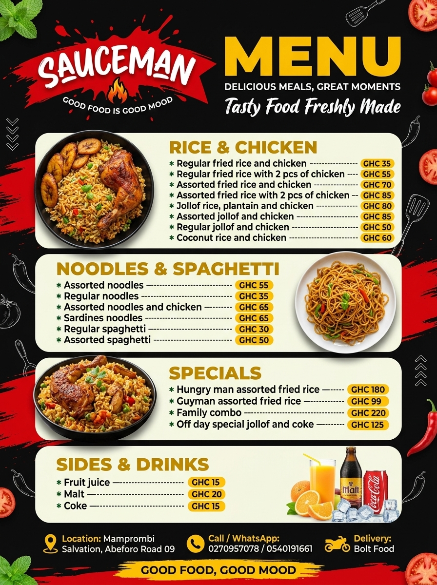

# -design-portfolio
A portfolio showcasing my graphic design work, including custom flyers, promotional designs, and branding projects created for clients.
<!DOCTYPE html>
<html lang="en">
<head>
  <meta charset="UTF-8">
  <meta name="viewport" content="width=device-width, initial-scale=1.0">

  <title>Built Weblabb | Graphic Design Portfolio</title>

  
</head>

<body>

  <header>
    <h1>BUILT WEBLABB</h1>

    

      Graphic Design • Branding • Creative Designs
    

    

      Turning ideas into visuals.
    

    <a
      class="button"
      href="https://wa.me/233503833630"
      target="_blank">
      💬 Chat With Me on WhatsApp
    </a>
  </header>

  <section class="section-title">
    <h2>My Work</h2>
    
Some of my recent graphic design projects.

  </section>

  <section class="portfolio">

    

      

      

        <h3>Custom Flyer Design</h3>
        
Graphic Design

      

    

  </section>

  <section class="contact">

    <h2>Need a Design?</h2>

    

      Looking for a flyer, advertisement, menu or promotional design?
    

    <a
      class="button"
      href="https://wa.me/233503833630"
      target="_blank">
      Contact Me
    </a>

  </section>

  <footer>
    © 2026 Built Weblabb. All Rights Reserved.
  </footer>

</body>
</html>
